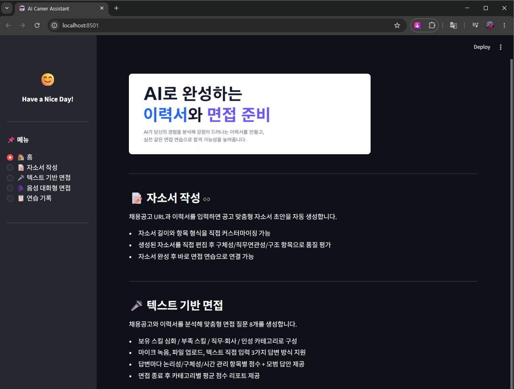
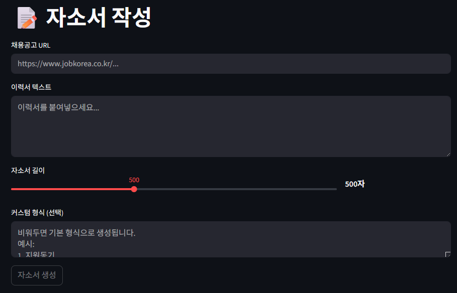
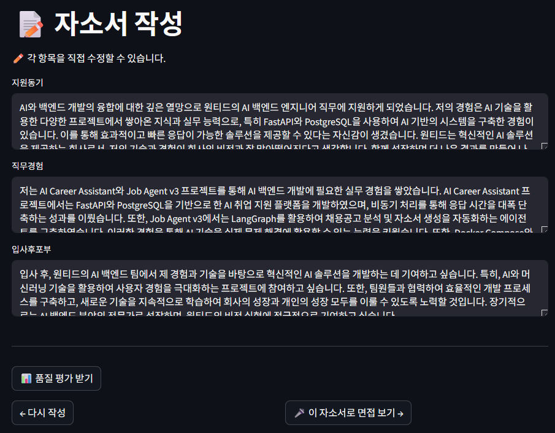
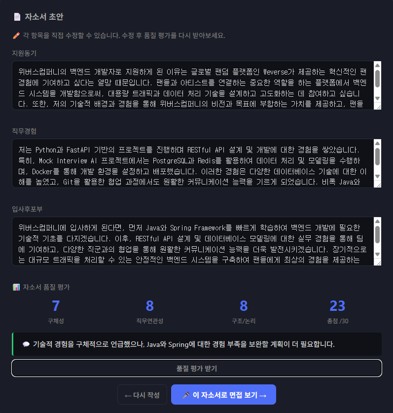
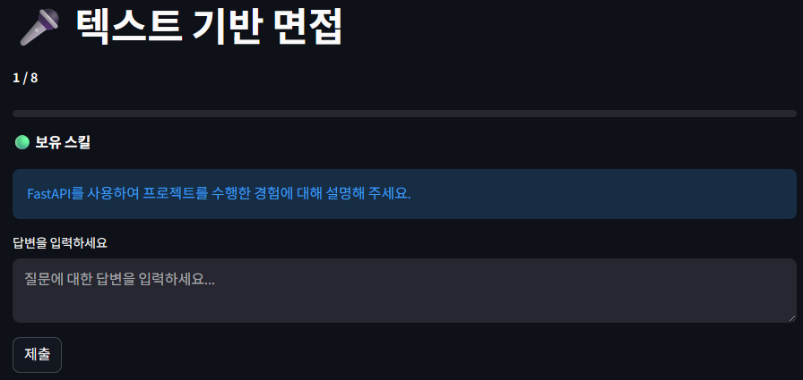
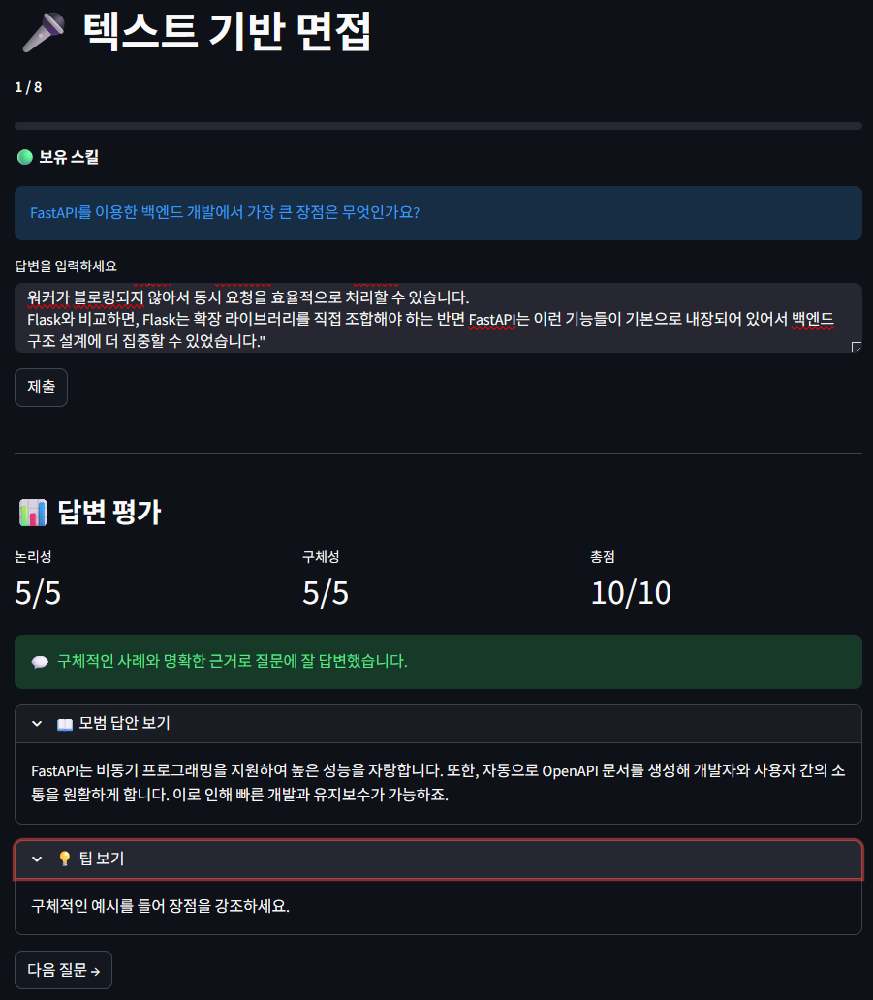
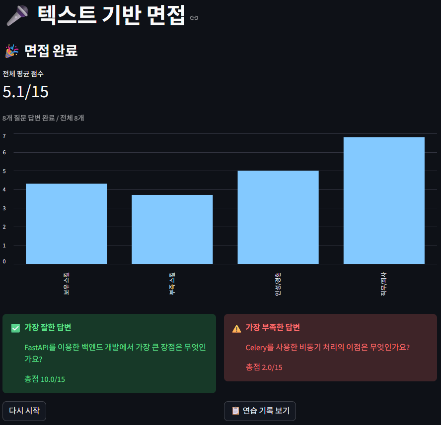
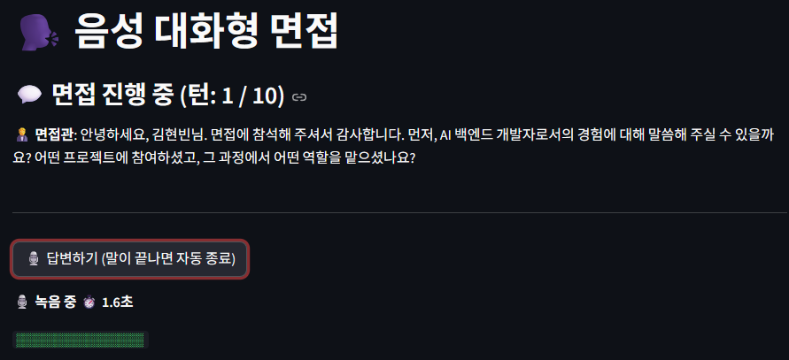
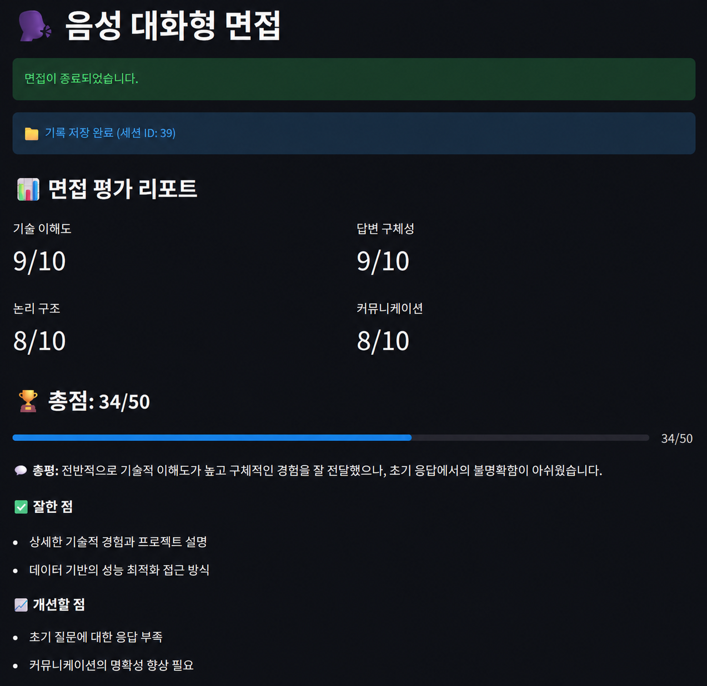
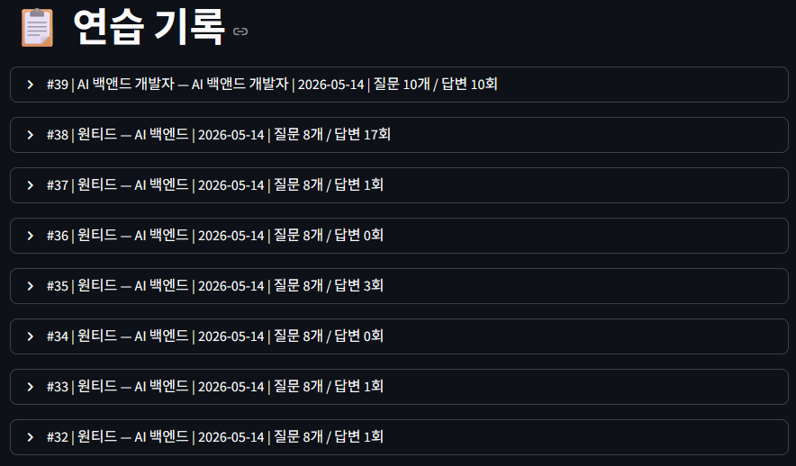

# 🤖 AI Career Assistant


채용공고 분석부터 자소서 작성, 면접 연습, 음성 대화형 면접까지 한 세션에서 완결되는 AI 취업 지원 플랫폼.

[Job Agent 시리즈](https://github.com/HyeonBin0118/job-agent-v3)와 [Mock Interview AI](https://github.com/HyeonBin0118/mock-interview-ai)를 하나의 백엔드로 통합하면서, FastAPI + 비동기 처리 구조로 재설계한 프로젝트.

기술 의사결정 상세: [TECH_DECISIONS](https://github.com/HyeonBin0118/ai-career-assistant-notes)

## 🎬 데모 영상

[](https://youtu.be/gNBGeOUz5qk)

---

## 핵심 성과

| 항목 | 결과 |
|---|---|
| Redis 캐싱 적용 | 34.5초 → 25.7초 (25% 단축) |
| Celery 비동기 처리 | 30초+ → 2.1초 (93% 단축) |
| 평가 일관성 (temp=0) | 표준편차 0 (완전 결정론적) |
| 답변 변별력 | 좋은 답 15점 vs 나쁜 답 7점 |
| 음성 면접 꼬리질문 | 답변 키워드 기반 실시간 후속 질문 생성 |

---

## 주요 기능

| 기능 | 설명 |
|---|---|
| 자소서 작성 | 채용공고 URL + 이력서 → 맞춤형 자소서 생성 + 품질 평가 |
| 면접 연습 | 공고 기반 질문 8개 + 텍스트 답변 + 논리성/구체성 항목별 점수 |
| 음성 대화형 면접 | 면접관 AI와 실시간 음성 대화 + 꼬리질문 + 최종 리포트 |
| 연습 기록 | 모든 세션 DB 저장 + 과거 기록 조회 |

---

## 시스템 아키텍처

```
[Streamlit UI]
      │  자소서 / 면접연습 / 음성면접 / 기록
      │
      ▼
[Edge-TTS] ← [GPT-4o-mini] ←── [FastAPI] ──────► [PostgreSQL]
              꼬리질문 생성         │               (세션/질문/답변/평가)
                                    │  ──────► [Redis]
[Whisper STT] → 음성 인식           │           (캐시 + 메시지 브로커)
                                    │               │
                                    │               ▼
                                    │          [Celery Worker]
                                    │            (Whisper 음성 변환)
                                    │               │
                                    └──────► [OpenAI API] ◄┘
```

- API 서버: FastAPI (uvicorn)
- 통합 UI: Streamlit (자소서 + 면접연습 + 음성면접 + 기록)
- DB: PostgreSQL (세션/질문/답변/평가 4개 테이블)
- 캐시 + 메시지 브로커: Redis 단일 인스턴스 (1인 2역)
- 비동기 워커: Celery (Whisper 음성 변환 처리)
- 컨테이너: Docker Compose 4개 서비스

---

## 프로젝트 구조

```
ai-career-assistant/
├── streamlit_app.py           # 통합 Streamlit UI (자소서/면접/음성면접/기록)
├── app/
│   ├── api/v1/
│   │   ├── sessions.py        # 세션 엔드포인트 (텍스트 + 음성 면접)
│   │   ├── answers.py         # 답변 및 평가 엔드포인트
│   │   └── cover_letter.py    # 자소서 생성/평가 엔드포인트
│   ├── core/
│   │   └── config.py
│   ├── services/
│   │   ├── interview.py       # 크롤링, 질문 생성, 자소서 생성 로직
│   │   ├── evaluation.py      # GPT 평가 로직 (논리성/구체성)
│   │   └── cache.py           # Redis 캐싱
│   ├── database.py
│   ├── models.py
│   ├── schemas.py
│   └── main.py
├── voice/
│   ├── recorder.py            # 마이크 녹음 + silence detection
│   ├── stt.py                 # Whisper STT (base/medium/large)
│   └── tts.py                 # Edge-TTS 면접관 음성 출력
├── alembic/                   # DB 마이그레이션
├── evaluation/                # 정량 평가 스크립트
├── tests/
├── docker-compose.yml
└── requirements.txt
```

---

## DB 모델

```
InterviewSession → Question → Answer → EvaluationResult
(공고 + 이력서)    (질문 8개)  (텍스트/음성)  (GPT 평가 결과)
```

텍스트 면접과 음성 대화형 면접 모두 동일한 DB 구조에 저장. 세션 하나당 질문 여러 개, 질문 하나당 답변 여러 번 — 반복 연습 시 점수 변화를 추적할 수 있는 구조.

---

## 사용 흐름

```
[자소서 작성]
채용공고 URL + 이력서 입력
→ 공고 크롤링 + 분석 (Redis 캐싱)
→ 맞춤형 자소서 생성
→ 구체성/직무연관성/구조 품질 평가
→ 면접 연습으로 연결

[면접 연습]
공고 + 이력서 기반 질문 8개 생성
→ 텍스트로 답변 입력
→ 논리성/구체성 항목별 점수 + 피드백 + 모범 답안
→ 면접 완료 리포트

[음성 대화형 면접]
이름/직무 입력 (+ 선택: 채용공고 URL)
→ 면접관 음성 질문 (Edge-TTS)
→ 마이크 답변 → Whisper 인식 → 꼬리질문 생성
→ 10턴 반복 후 항목별 평가 리포트
→ 대화 기록 DB 저장

공통: 모든 연습 기록은 PostgreSQL에 저장되어 재조회 가능
```

---

## 주요 화면

| | |
|---|---|
|  |  |
| 홈 화면 | 자소서 입력 |
|  |  |
| 자소서 생성 결과 | 자소서 품질 평가 |
|  |  |
| 면접 질문 진행 | 답변 피드백 |
|  |  |
| 면접 완료 리포트 | 음성 대화형 면접 |
|  |  |
| 음성 면접 평가 리포트 | 연습 기록 조회 |

---

## 기술 의사결정

| 기술 | 선택 이유 |
|---|---|
| FastAPI | Whisper/GPT 호출이 I/O bound → async 네이티브 지원, Swagger 자동 생성 |
| Streamlit | 사이드바 설정 + 빠른 프로토타이핑, UI와 API 역할 분리 |
| Edge-TTS | 무료, 한국어 음질 자연스러움. OpenAI TTS 대비 비용 없이 충분한 품질 |
| PostgreSQL | JSONB 지원, ACID 트랜잭션, 관계형 데이터 구조에 적합 |
| SQLAlchemy (동기) | 병목은 DB가 아닌 Whisper(20초). 스레드풀로 기본 동시성 확보, 복잡도 최소화 |
| Redis | 캐시 + Celery 브로커 1인 2역. 인프라 추가 없이 두 역할 동시 처리 |
| Celery | BackgroundTasks와 달리 워커 스케일 아웃 가능, 작업 유실 없음 |
| GPT-4o-mini | 세션당 호출 10회+. GPT-4 대비 60배 저렴하면서 구조화 작업엔 충분한 품질 |
| Docker Compose | PostgreSQL + Redis + Celery 4개 서비스를 1줄(`docker-compose up`)로 재현 |

---

## 정량 평가

### 1. Redis 캐싱 효과 (단계별 측정)

| 단계 | 캐시 적용 전 | 캐시 적용 후 |
|---|---|---|
| 크롤링 + 공고 분석 | 6,538ms | 0ms |
| 이력서 매칭 | 5,138ms | 4,483ms |
| 질문 생성 | 22,829ms | 21,254ms |
| **전체** | **34,514ms** | **25,737ms** |

> 캐싱으로 약 **8,800ms (25%) 단축**. 질문 생성이 전체의 65% 이상을 차지하는 병목으로 측정. 질문 생성은 이력서×공고 조합마다 달라야 해서 캐싱 대상에서 제외.

### 2. 답변 평가 일관성 (temperature=0, n=10)

| 답변 품질 | 평균 점수 | 표준편차 |
|---|---|---|
| 좋은 답변 (구체적 수치 + 프로젝트 포함) | 15.0 | 0.0 |
| 보통 답변 (관련 있지만 추상적) | 12.0 | 0.0 |
| 나쁜 답변 (질문과 무관한 내용) | 7.0 | 0.0 |

> temperature=0 환경에서 평가가 완전히 결정론적으로 작동함을 확인. 표준편차 0은 같은 입력에 대해 항상 같은 점수를 반환함을 의미.

### 3. Celery 비동기 처리 성능 (n=5)

| 측정 항목 | 결과 |
|---|---|
| 즉시 응답 평균 | 2.091초 |
| 즉시 응답 최소 | 2.070초 |
| 즉시 응답 최대 | 2.138초 |
| 기존 동기 처리 | 30초+ |

> Celery 워커가 백그라운드에서 처리하도록 분리 → 서버는 파일 접수 즉시 응답. 프론트엔드가 0.5초 간격으로 완료 여부를 폴링하는 구조. Redis가 캐시와 메시지 브로커 두 가지 역할을 동시에 수행.

---

## 설치 및 실행

```bash
# 1. 레포 클론
git clone https://github.com/HyeonBin0118/ai-career-assistant.git
cd ai-career-assistant

# 2. 가상환경 설정
conda create -n mock_interview python=3.11
conda activate mock_interview
pip install -r requirements.txt

# 3. 환경변수 설정
cp .env.example .env
# .env 파일에서 OPENAI_API_KEY 입력
# DATABASE_URL: Docker 내부 → @db / 로컬 실행 → @localhost

# 4. Docker Compose 실행
docker-compose up -d

# 5. DB 마이그레이션
alembic upgrade head

# 6. 음성 면접 추가 패키지 설치
pip install edge-tts sounddevice soundfile openai-whisper

# 7. Streamlit 앱 실행
streamlit run streamlit_app.py
```

테스트:
```bash
pytest  # 단위 테스트 (세션 생성, 질문 조회, 답변 제출, 캐시 MISS→HIT 검증)
```

정량 평가 실행:
```bash
python evaluation/eval_consistency.py       # GPT 평가 일관성 (표준편차 0 측정)
python evaluation/eval_prompt_compare.py    # 프롬프트 개선 전/후 비교
python evaluation/eval_async_performance.py # 비동기 처리 응답시간 측정
```

---

## 개발 환경

- OS: Windows 10
- Python: 3.11 (Anaconda)
- 컨테이너: Docker Compose 4개 서비스
- CI: GitHub Actions (push 시 자동 테스트)

---

## 향후 개선 과제

1. **블루투스 마이크 호환성 개선** — 에어팟 등 블루투스 입력 장치의 silence detection 안정화
2. **WebSocket 기반 실시간 진행률 전송** — 현재 0.5초 폴링 방식을 서버 푸시로 전환
3. **Rubric 기반 평가 체계 명시화** — 평가 항목 분리 (질문 연관성 / 구체성 / 논리 구조 / 시간 안배)
4. **Human Evaluation 실험** — 실제 면접관 평가와 GPT 평가의 상관계수 측정
5. **AWS 배포** — EC2 + Docker + HTTPS + GitHub Actions 자동 배포

---

## 한계 인정

GPT 평가의 한계: 평가자도 GPT, 생성자도 GPT인 구조이므로 자기 평가에 관대해질 가능성이 있습니다. 답변 품질에 따라 점수 차이는 명확하지만(좋은 답 15점 vs 나쁜 답 7점), 절대적인 평가 신뢰도는 사람 평가와의 교차 검증이 필요합니다.

이 한계를 인지한 상태에서 첫 버전을 우선 완성하고, Human Evaluation을 향후 개선 과제로 두었습니다.

---

## 관련 프로젝트

- [Mock Interview AI](https://github.com/HyeonBin0118/mock-interview-ai) — 이 프로젝트의 출발점 (음성 평가 파이프라인)
- [Job Agent v3](https://github.com/HyeonBin0118/job-agent-v3) — 채용공고 분석 + 자소서 생성

---

License: MIT
